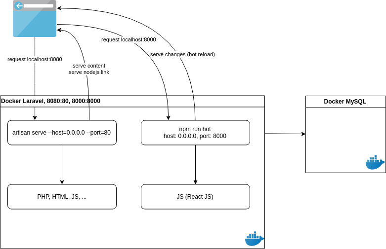

# Docker development environment for Jobbar

[Jobbar](https://github.com/ut-connewitz/jobbar-dev-env) is a job scheduling app, specified to organize tasks for events.

## This docker environment contains

- Laravel
- MariaDB (MySQL)
- PHPMyAdmin (optional)

## How to install

Clone this repo to your project folder and the [Jobbar](https://github.com/ut-connewitz/jobbar-dev-env) repo on the same level.

Your folder structure should be:

- project/
    - jobbar-app/
    - jobbar-dev-env/


## How to start

Build and start the development environment with:

```
docker-compose up
```

The jobbar should accessible at `http://localhost:8080`

## Development

TODO some development tips (folders/classes/...)

## Architecture

Architecture of the development environment



### Configuration

- change ports: change ports on your docker-compose file requieres to change it also

## Tests

Run tests in your laravel container:

```
docker exec -it <container-id> composer test
```

Some tests are currently implemented in `tests/Unit/JobTest.php`


## Deployment

Create productive:

```
docker exec -it <container-id> npm run prod
```

- exec into container, run `npm run prod`

## License

The Jobbar is open-sourced software licensed under the [MIT license](https://opensource.org/licenses/MIT).
